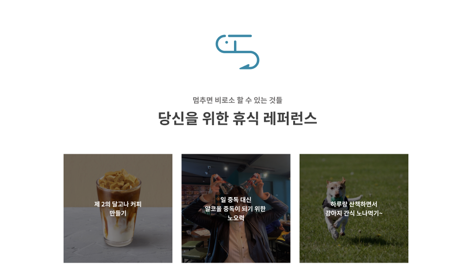

# For Ideal SOPT Hitchhiking

   

> 일 중독자 솝트인들을 위한 안내서!


## :baby_chick: Demo
<p float="left">
  
  
  
  
  
  
  
</p>

## 🔧 Credit
- **Language**: JavaScript
- **Framework & Library** : React.js, Redux

## 💻 Getting Started

### Installation
```bash
$ git clone https://github.com/soptkerthon-kyahaha/kyahaha-frontend.git
$ cd [project-name]
$ npm install
```
### Develop Mode
```
$ npm start
```
## 🤝Team role
  
> 💻 team developer 

| **🙋 [김동관](https://github.com/dk-master)** | **🙋‍ [박재성](https://github.com/jaeseongDev)** | **🙋‍ [이현진](https://github.com/hyundang)** |
| :---: |:---:| :---:|
| []()    | []() | []()  |
| 웹 개발자 | 웹 개발자| 웹 개발자|
|컴포넌트구성<br /> 시간 컴포넌트 <br /> 힐링 컴포넌트 <br /> 통신라우팅 연결 </br>|컴포넌트구성<br /> 메인페이지 <br /> 게시물 리스트 컴포넌트 <br /> 통신 라우팅 연결 </br> |컴포넌트구성<br /> 게시물리스트 컴포넌트 <br /> 힐링 컴포넌트 <br /> 랜덤선택 컴포넌트</br>|
  
<br />

## 👨‍👩‍👧‍👦 Developer & Role
*  **이현진** ([hyundang](https://github.com/hyundang)) - 컴포넌트 구성, 통신 라우팅 연결, 퍼블리싱
*  **김동관** ([dk-master](https://github.com/dk-master)) - 컴포넌트 구성, 통신 라우팅 연결, 퍼블리싱
*  **박재성** ([jaeseongDev](https://github.com/jaeseongDev)) - 컴포넌트 구성, 통신 라우팅 연결, 퍼블리싱
