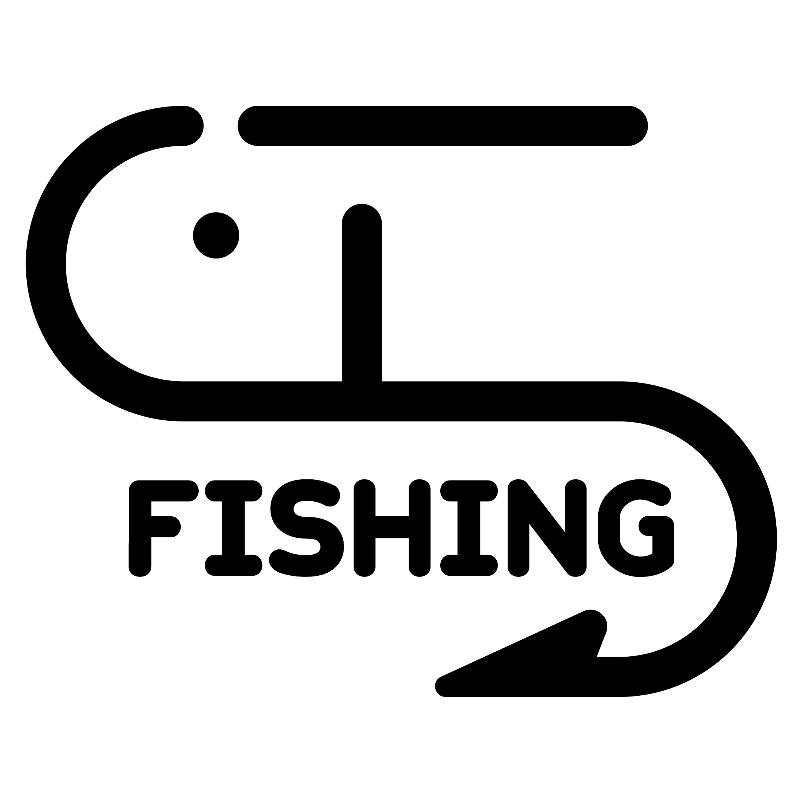
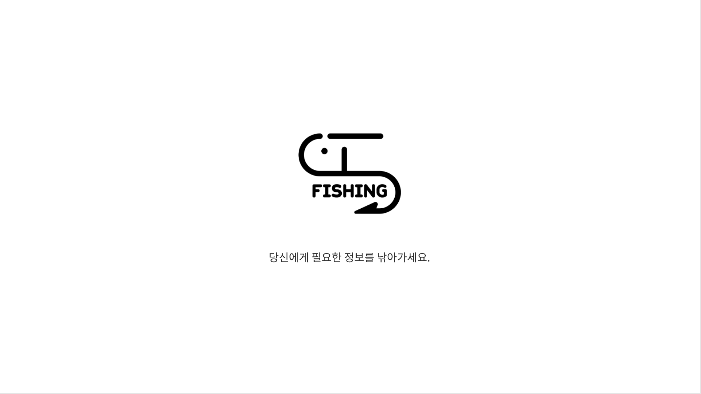
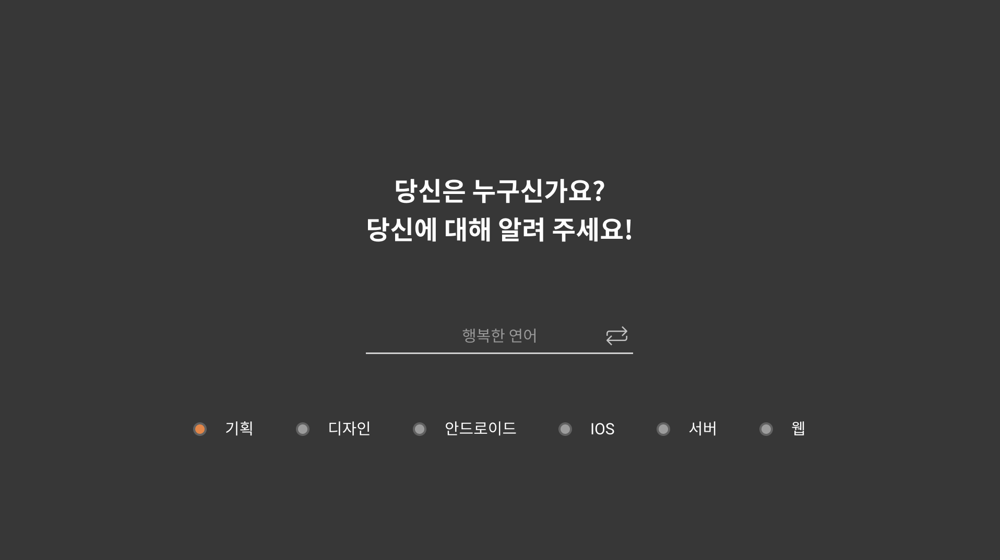
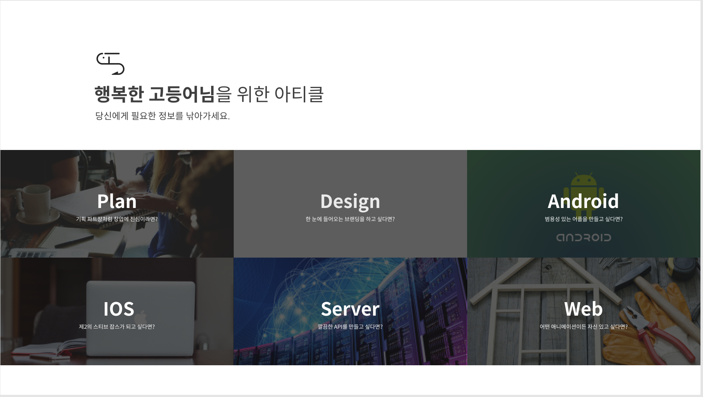
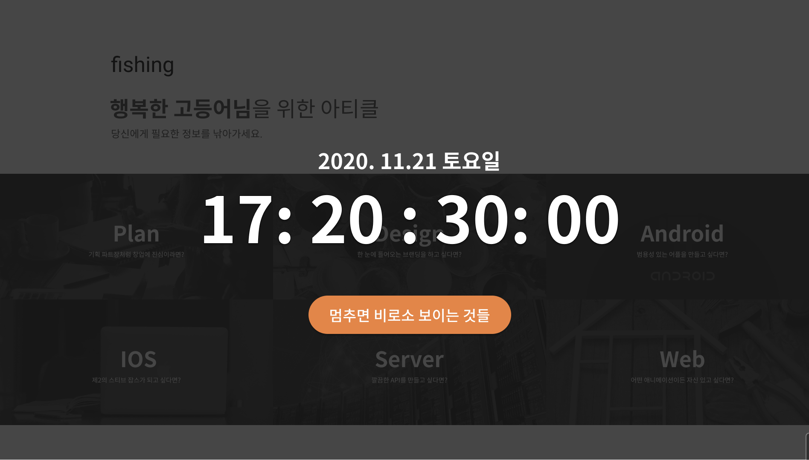
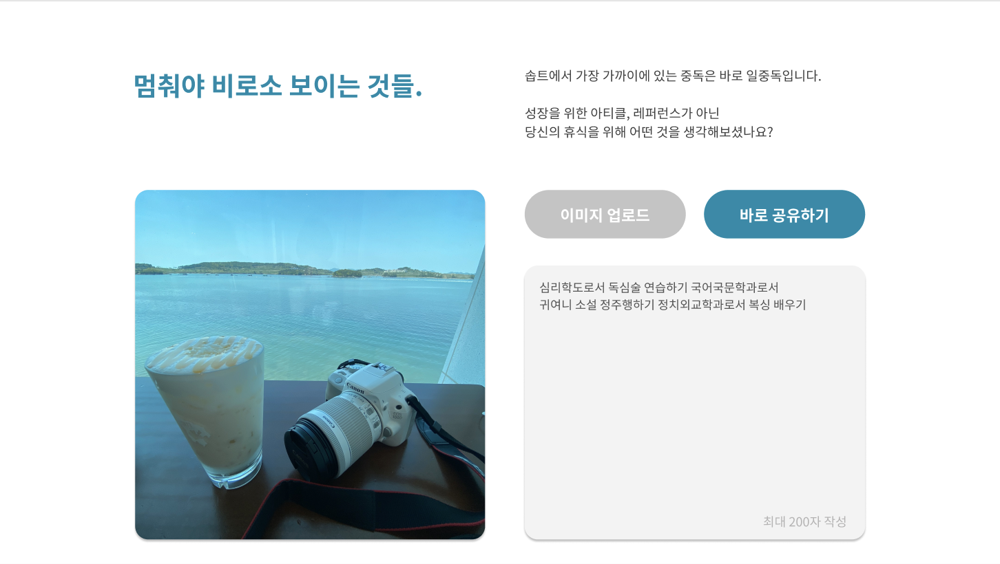

# For Ideal SOPT Hitchhiking

   

> 일 중독자 솝트인들을 위한 안내서!




## :baby_chick: Demo
<p float="left">
  
  
  
  
  
  
</p>

## 🔧 Credit
- **Language**: JavaScript
- **Framework & Library** : React.js, Redux

## 💻 Getting Started

### Installation
```bash
$ git clone https://github.com/soptkerthon-kyahaha/kyahaha-frontend.git
$ cd [project-name]
$ npm install
```
### Develop Mode
```
$ npm start
```


## 👨‍👩‍👧‍👦 Developer & Role
*  **이현진** ([hyundang](https://github.com/hyundang)) - 컴포넌트 구성, 통신 라우팅 연결, 퍼블리싱
*  **김동관** ([dk-master](https://github.com/dk-master)) - 컴포넌트 구성, 통신 라우팅 연결, 퍼블리싱
*  **박재성** ([yeoneei](https://github.com/jaeseongDev)) - 컴포넌트 구성, 통신 라우팅 연결, 퍼블리싱
